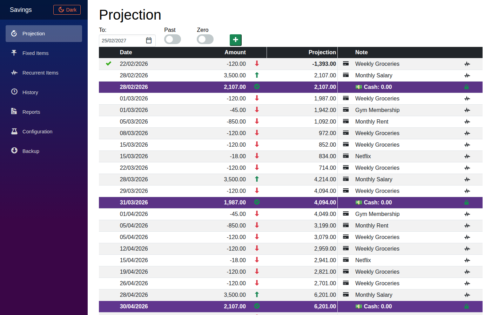
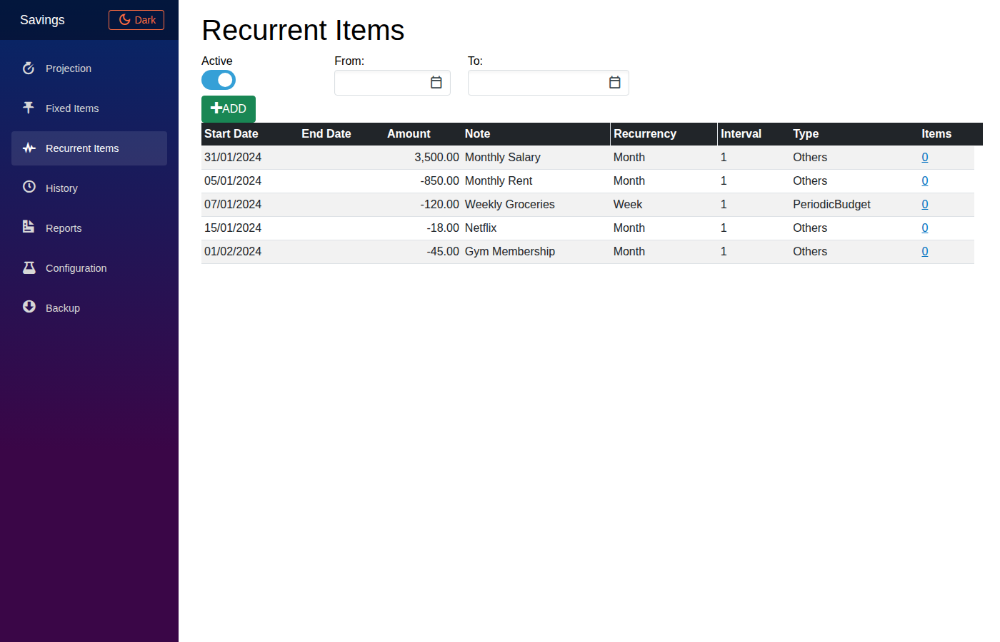

# Savings-Projection

Project your income into the future while also taking expenses into account.

  

## Technologies

  

- Blazor

- Radzen Blazor

- ASP.NET Core

- Entity Framework Core

- SQLite

- Electron

  
  
  

## Screenshots

  

**Savings Projection**



  
  

**Recurrent Items**



  

## Security
The application supports the following way to be secured:

 1. ApiKey
 2. Azure AD

### ApiKey

 1. Add the following configuration in the SavingsProjection.API's 'appsettings.json': 
   ``` 
  "AuthenticationToUse": "ApiKey", 
  "ApiKeys": "keyToUse",`
```
 2. Add the following configuration in the SavingsProjection.SPA's 'appsettings.json': 
   ``` 
  "AuthenticationToUse": "ApiKey", 
  "ApiKeys": "keyToUse",`
```

### Azure AD
You need to configure in Azure AAD, two app registrations for SavingsProjection.API and SavingsProjection.SPA. For the SavingsProjection.API you need to expose and API with the scope name 'SavingProjection.All'. For the SavingsProjection.SPA you need  to configure an API permission for the previous one.

 1. Add the following configuration in the SavingsProjection.API's 'appsettings.json': 
   ``` 
  "AuthenticationToUse": "AzureAD",
"IdentityProvider": {
	"Authority": "https://login.microsoftonline.com/{tenantID}/",
	"Audience": "api://{apiClientID}"
}
```
 2. Add the following configuration in the SavingsProjection.SPA's 'appsettings.json': 
   ``` 
  "AuthenticationToUse": "AzureAD", 
  "AzureAd": {
	"Authority": "https://login.microsoftonline.com/{tenantID}/",
	"ClientId": "{spaClientID}",
	"ValidateAuthority": true,
	"DefaultScope": "api://{apiClientID}/SavingProjection.All"
}
```